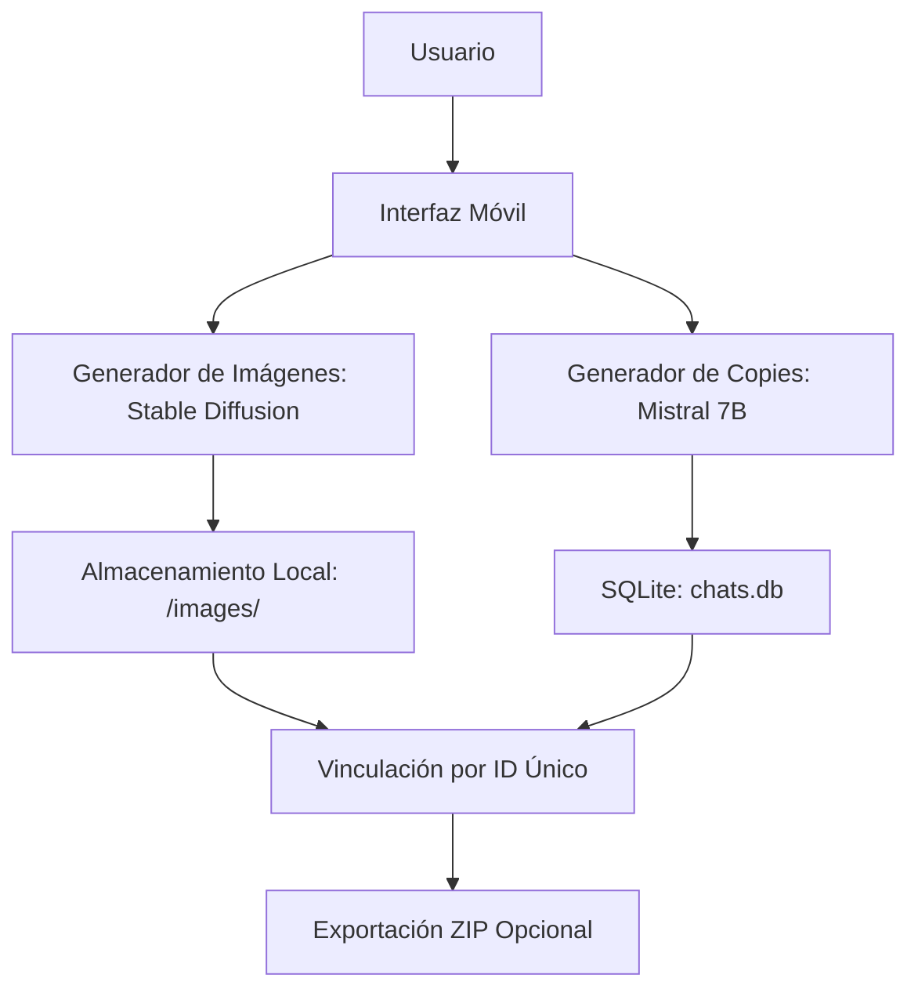
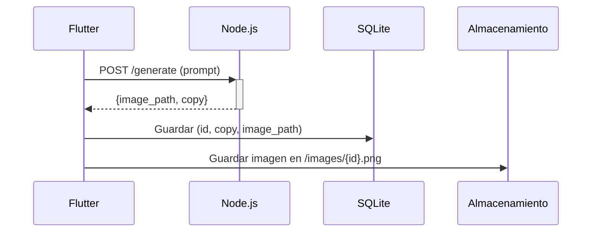

# myAppCopy

1. Objetivo 
Desarrollar una aplicación móvil que:  
- Genere imágenes y copies para redes sociales usando IA.  
- Almacene todo **localmente** en el dispositivo (sin servidores).  
- Vincule imágenes y chats mediante **IDs únicos** para optimizar memoria.  

---

2. Arquitectura General
   


---

3. Componentes Clave
   
A. Generación de Contenido  
| **Función**           | **Tecnología Propuesta**       | **Descripción**                                  |  
|-----------------------|--------------------------------|------------------------------------------------|  
| **Imágenes**          | Stable Diffusion XL (ONNX)     | Modelo optimizado para móviles (inferencia local). |  
| **Textos/Copies**     | Mistral 7B (cuantizado)        | Versión ligera para CPU/GPU móvil.              |  

B. Almacenamiento Local**  
| **Dato**              | **Ubicación**                  | **Formato**           |  
|-----------------------|--------------------------------|-----------------------|  
| Metadatos (chats)     | SQLite (tabla `content`)       | ID, texto, ruta_imagen|  
| Imágenes              | `/data/images/`                | PNG/WebP (80% calidad)|  

C. Vinculación de Datos
- **Estructura de la tabla SQLite:  
  ```sql
  CREATE TABLE content (
      id TEXT PRIMARY KEY,
      chat_text TEXT,
      image_path TEXT,
      created_at INTEGER
  );
  ```

---

4. Flujo de Datos 
1. **Paso 1**: Usuario ingresa un brief (ej.: "Anuncio de café artesanal").  
2. **Paso 2**: La app:  
   - Genera un **ID único** (`UUID`).  
   - Ejecuta Stable Diffusion para crear la imagen (guarda en `/images/{ID}.webp`).  
   - Ejecuta Mistral 7B para el copy (guarda en SQLite con `image_path` vinculado).  
3. **Paso 3**: Al abrir el historial:  
   - Carga solo los textos desde SQLite.  
   - Las imágenes se cargan bajo demanda (`BitmapFactory.decodeFile()`).  

---

5. Requisitos Técnicos
   
| **Área**                     | **Detalle**                                                                          |  
|------------------------------|--------------------------------------------------------------------------------------|  
| **Plataforma**               | Android (Kotlin) + iOS (Swift) - Usaremos Kotlin Multiplatform para compartir lógica.|  
| **RAM Mínima**               | 3GB (para inferencia de IA).                                                         |  
| **Almacenamiento**           | 100MB libres (para modelos y caché).                                                 |  

---


6. Limitaciones y Soluciones
     
| **Limitación**               | **Mitigación**                             |  
|------------------------------|--------------------------------------------|  
| Inferencia lenta en móviles  | Usar modelos cuantizados (ej.: GGUF).      |  
| Espacio en disco             | Compresión WebP + limpieza automática.     |  
| Sin sincronización en la nube| Exportación manual a Google Drive/Dropbox. |  

---

**📚 Documentación Técnica: Lenguajes y Tecnologías**  

 **1. Flutter (Dart) - Frontend Móvil**  
**Descripción**:  
Framework de desarrollo multiplataforma para crear interfaces móviles (iOS/Android) desde un solo código base.  

**Uso en el Proyecto**:  
- **Interfaz de usuario**: Pantallas para generación de imágenes, historial de contenido, ajustes.  
- **Comunicación con Backend**: Consumo de APIs REST (`http` o `Dio`).  
- **Gestión de estado**: Provider o Riverpod.  

**Ejemplo (Dart)**:  
```dart
// Llamada API al backend
Future<void> generateContent(String prompt) async {
  final response = await http.post(
    Uri.parse('https://api.digitallocal.com/generate'),
    body: jsonEncode({'prompt': prompt}),
  );
  if (response.statusCode == 200) {
    print('¡Contenido generado!');
  }
}
```  

**Recursos**:  
- [Documentación Oficial](https://flutter.dev)  
- [Paquetes Útiles](https://pub.dev): `http`, `sqflite`, `cached_network_image`.  

---

**2. Node.js + Express - Backend**  
**Descripción**:  
Entorno de ejecución JavaScript para construir APIs rápidas y escalables.  

**Uso en el Proyecto**:  
- **Endpoints REST**: Procesar solicitudes de generación de contenido.  
- **Lógica de negocio**: Coordinar llamadas a IA (si se migra a la nube).  
- **Autenticación**: JWT o Firebase Auth.  

**Ejemplo (JavaScript)**:  
```javascript
const express = require('express');
const app = express();

app.post('/generate', (req, res) => {
  const { prompt } = req.body;
  // Lógica para generar contenido
  res.json({ image: 'ruta/imagen.png', copy: 'Texto generado' });
});

app.listen(3000, () => console.log('Server running'));
```  

**Recursos**:  
- [Documentación Express](https://expressjs.com)  
- [Módulos Clave](https://www.npmjs.com): `cors`, `jsonwebtoken`, `axios`.  

---
 **3. SQLite - Base de Datos Local**  
**Descripción**:  
Motor de base de datos ligero y embebido, ideal para almacenamiento local en móviles.  

**Uso en el Proyecto**:  
- **Almacenar**: Chats, rutas de imágenes, metadatos.  
- **Consultas rápidas**: Búsqueda por IDs, filtrado por fecha.  

**Ejemplo (Kotlin con Android)**:  
```kotlin
// Crear tabla en SQLite
db.execSQL("""
    CREATE TABLE content (
        id TEXT PRIMARY KEY,
        chat_text TEXT,
        image_path TEXT
    )
""")
```  

**Recursos**:  
- [SQLite en Flutter](https://pub.dev/packages/sqflite)  
- [SQLite en Node.js](https://www.npmjs.com/package/sqlite3) (si se usa en backend).  

---

**🔗 Integración entre Componentes**  


---

 **⚙️ Requisitos de Instalación**  
 **Flutter**:  
```bash
# Instalación básica
$ git clone https://github.com/flutter/flutter.git
$ export PATH="$PATH:`pwd`/flutter/bin"
$ flutter doctor
```  

**Node.js**:  
```bash
# Instalación en Linux/macOS
$ curl -fsSL https://deb.nodesource.com/setup_18.x | sudo -E bash -
$ sudo apt-get install -y nodejs
```  

 **SQLite en Flutter**:  
```yaml
# pubspec.yaml
dependencies:
  sqflite: ^2.3.0
  path_provider: ^2.1.1
```  

---

 **📌 Notas Clave**  
1. **Flutter y Node.js se comunican via HTTP/HTTPS**.  
2. **SQLite es solo para almacenamiento local** (no requiere servidor).  
3. **Para escalar**, puedes reemplazar SQLite por Firebase o PostgreSQL en el futuro.


**Documentación adicional**:  
- [Flutter + Node.js Tutorial](https://medium.com/swlh/flutter-with-node-js-backend-99ffb9b8b437)  
- [SQLite Best Practices](https://www.sqlite.org/docs.html) 

**Flujo de tabajo entre los componentes**
graph LR
    A[Flutter UI] -->|HTTP POST| B[Backend Express]
    B --> C[Generador de Imágenes]
    C --> D[(storage/)]
    B --> E[APIs Redes Sociales]
    B --> F[(Base de Datos)]
    E -->|Post ID| A

