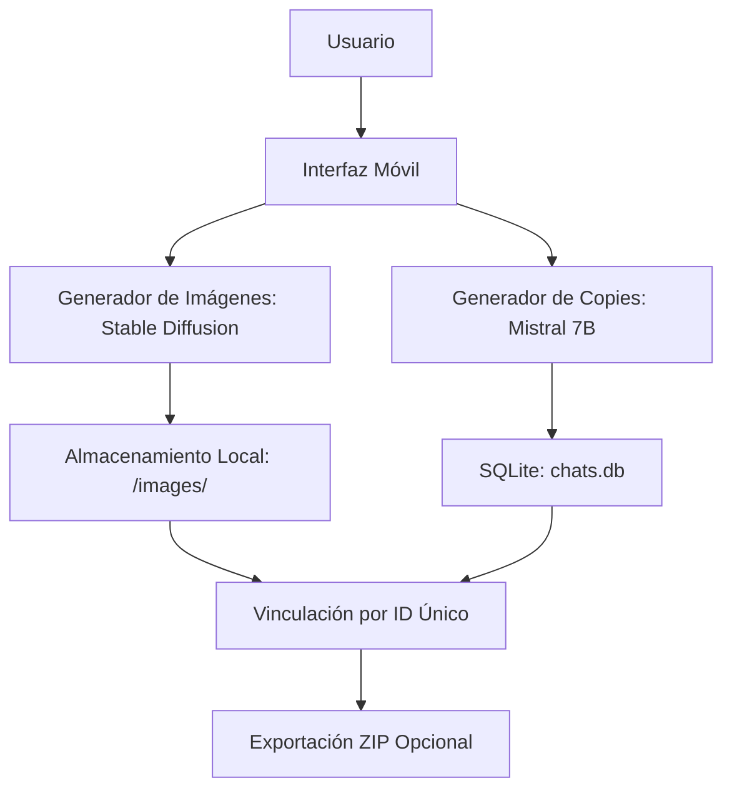

# myAppCopy
una aplicacion para general publicidad


1. Objetivo 
Desarrollar una aplicación móvil que:  
- Genere imágenes y copies para redes sociales usando IA.  
- Almacene todo **localmente** en el dispositivo (sin servidores).  
- Vincule imágenes y chats mediante **IDs únicos** para optimizar memoria.  

---

2. Arquitectura General
   


---

3. Componentes Clave
   
A. Generación de Contenido  
| **Función**           | **Tecnología Propuesta**       | **Descripción**                                  |  
|-----------------------|--------------------------------|------------------------------------------------|  
| **Imágenes**          | Stable Diffusion XL (ONNX)     | Modelo optimizado para móviles (inferencia local). |  
| **Textos/Copies**     | Mistral 7B (cuantizado)        | Versión ligera para CPU/GPU móvil.              |  

B. Almacenamiento Local**  
| **Dato**              | **Ubicación**                  | **Formato**           |  
|-----------------------|--------------------------------|-----------------------|  
| Metadatos (chats)     | SQLite (tabla `content`)       | ID, texto, ruta_imagen|  
| Imágenes              | `/data/images/`                | PNG/WebP (80% calidad)|  

C. Vinculación de Datos
- **Estructura de la tabla SQLite:  
  ```sql
  CREATE TABLE content (
      id TEXT PRIMARY KEY,
      chat_text TEXT,
      image_path TEXT,
      created_at INTEGER
  );
  ```

---

4. Flujo de Datos 
1. **Paso 1**: Usuario ingresa un brief (ej.: "Anuncio de café artesanal").  
2. **Paso 2**: La app:  
   - Genera un **ID único** (`UUID`).  
   - Ejecuta Stable Diffusion para crear la imagen (guarda en `/images/{ID}.webp`).  
   - Ejecuta Mistral 7B para el copy (guarda en SQLite con `image_path` vinculado).  
3. **Paso 3**: Al abrir el historial:  
   - Carga solo los textos desde SQLite.  
   - Las imágenes se cargan bajo demanda (`BitmapFactory.decodeFile()`).  

---

5. Requisitos Técnicos  
| **Área**          | **Detalle**                                                                 |  
|-------------------|-----------------------------------------------------------------------------|  
| **Plataforma**    | Android (Kotlin) + iOS (Swift) - Usaremos Kotlin Multiplatform para compartir lógica. |  
| **RAM Mínima**    | 3GB (para inferencia de IA).                                                |  
| **Almacenamiento**| 100MB libres (para modelos y caché).                                        |  

---


6. Limitaciones y Soluciones
     
| **Limitación**               | **Mitigación**                              |  
|------------------------------|--------------------------------------------|  
| Inferencia lenta en móviles  | Usar modelos cuantizados (ej.: GGUF).      |  
| Espacio en disco             | Compresión WebP + limpieza automática.     |  
| Sin sincronización en la nube| Exportación manual a Google Drive/Dropbox. |  

---

PRÓXIMOS PASOS 
1. Definir stack tecnológico:  
   - ¿Kotlin Multiplatform o React Native?  
   - ¿ONNX o TensorFlow Lite para Stable Diffusion?
     
2. Documentar APIs locales:  
   - Ejemplo: Cómo llamar a Mistral 7B desde Kotlin.
     
3. Plan de pruebas:  
   - Rendimiento en dispositivos de gama baja/alta.  


